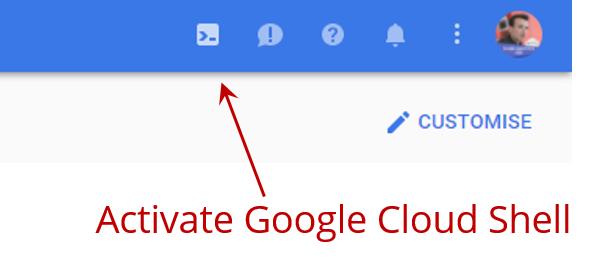
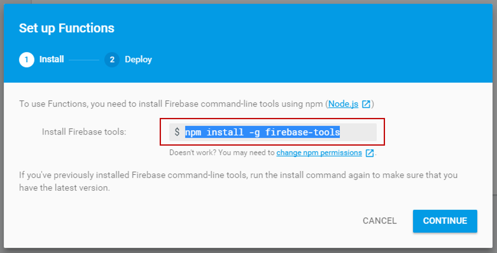
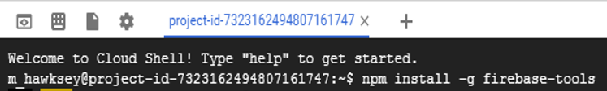
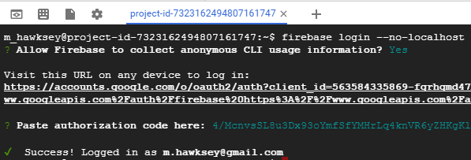
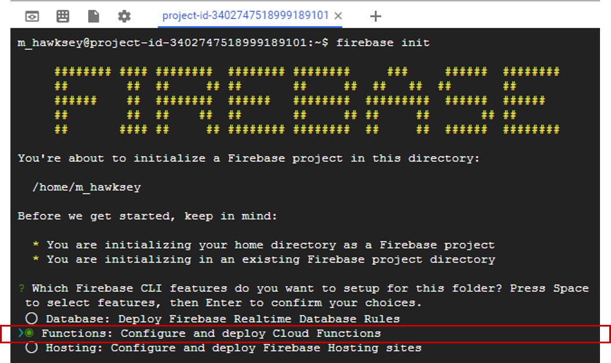
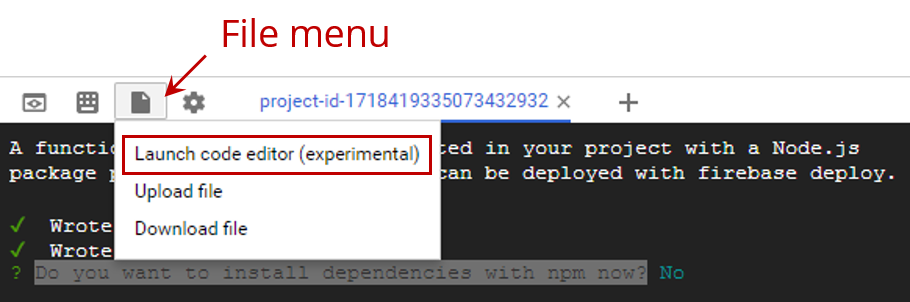
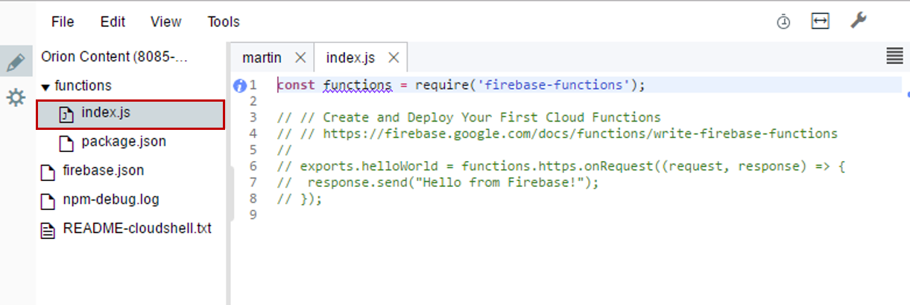
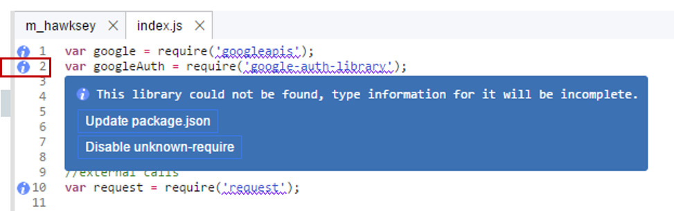

# Cloud Functions for Firebase in Google Apps Script
*This tutorial was developed by [Riël Notermans](https://developers.google.com/experts/people/ri-l-notermans) and [Martin Hawksey](https://developers.google.com/experts/people/martin-hawksey) GDEs for Google Apps Script. This tutorial is based on a supporting video featuring Riël going through and explaining each of these steps  [https://www.youtube.com/watch?v=yi5ktHjv_FE](https://www.youtube.com/watch?v=yi5ktHjv_FE)*

Google Apps Script is a powerful tool to integrate with Google products and third party services. As Apps Script is a free service which runs on Google servers there are quotas designed to prevent abuse of the service. These quotas can however sometimes prevent you from completing your project. In this tutorial we introduce Cloud Functions for Firebase as a solution for getting around some of the quota limits. In particular, we look at how you can get around issues when trying to fetch files greater than 10MB. In this tutorial we show how a Cloud Function can be used with Google Apps Script to fetch a large file, save it to your Google Drive and return a file id which can be used in the rest of your script project. 

>**Important:** In this tutorial as we are using a cloud function to make an external HTTP request which is not included in the Firebase Spark Free plan. We recommend upgrading your Firebase project to the Blaze Pay as you go plan. Given the requested file size in this tutorial the current estimated cost for each execution depends mostly on the outbound traffic in this case, which is 20Mb. Inbound (google services) do not count, so only the fetch. Pricing is about 0.25 cents on the Blaze plan for one execution. If you haven’t used Google Cloud before you can [get $300 of free credit for 12 months](https://cloud.google.com/free/).  If you are scared that you might do something wrong and create a loop, using loads of data, then in the Google Cloud platform you can set your maximum billing to $0. Here is more information on current [Firebase Pricing](https://firebase.google.com/pricing/). 
 
**Note:** In this tutorial we are using Cloud Functions for Firebase. Cloud Functions for Firebase  are essentially a wrapper around Google Cloud Functions, designed to make it easier to use and integrate these within your Firebase project and integrate with other Firebase services. If you are just using functions you might consider using Google Cloud Functions instead.

## Setting up and creating a Cloud Function for Firebase

1. Start a new script project [https://script.google.com/](https://script.google.com/)

2. In the Script Editor open Resources > Cloud Platform project…

3. In the dialog that opens click on the link under the ‘This script is currently associated with project:’ prompt. 

4. In the Google Developer Console window that opens click on the menu icon in the top left () and then click the Google Cloud Platform link from the bottom of the menu. [You can also avoid steps 1-4 to get directly to the Google Cloud Platform by visiting [https://console.cloud.google.com](https://console.cloud.google.com)]

5. In the Google Cloud Platform window that open click the Activate Google Cloud Shell 

6. Open the Firebase Console at [https://console.firebase.google.com/](https://console.firebase.google.com/) and create a new project (as noted at the start of this tutorial you'll need to modify your project to one of the paid plans - we recommend the Blaze Pay as you go for this tutorial).

7. In the new project click ‘Functions’ from the left side menu and then click ‘Get Started’.

8. In the window that opens copy the command `npm install -g firebase-tools` to the Google Cloud Shell window opened in step 5. (running this command also updates to the latest version)
> NPM  = Node Package Manager. If you wonder what it has to do with Cloud Functions for Firebase, let us explain. Functions run in the Node.js environment, just like Apps Script runs in the Apps Script environment. To add modules in Node scripts, you use npm to install them. NPM makes sure all libraries get installed or updated, and will update your package.json to let the node environment  know what modules are used. When you upload a function, you upload the installed modules as well (actually you upload the whole functions directory). The package.json file tells the environment what modules are installed. 
>
> The most common commands:
>
>**`npm install`**
>Reads package.json and installs all modules listed there. This is easy if you use someone else's function and need to install all modules that are needed.
>
>**`npm install packagename`**
>Install a separate package. Be alert: this does not update package.json!
>
>**`npm install packagename@version`**
>Install a specific version of a separate package. Be alert: this does not update package.json!
>
>**`npm install packagename --save`**
> Install a package and update package.json as well. This is what you usually do when writing your own cloud function.

9. It will take 1-2 minutes to install the Firebase tools and some errors may be thrown but these can be ignored for this tutorial. 

10. When it finishes still in the Google Cloud Shell window now type `firebase login --no-localhost`. If this is your first Firebase project you will need to follow the command prompts copy/pasting the authentication url into a new browser tab and once logged in and authenticated the authorisation code back into the Google Cloud Shell window. Once completed you should see a `Success! Logged in as …` message

11. In the shell make a project directory with mkdir cfdemo and then change directory cd cfdemo.
>Cloud Shell gives you a 5GB home directory which persist across sessions. Here is [more information on Cloud Shell. ](https://cloud.google.com/shell/)

12. To initiate Cloud Functions in our project now enter the command `firebase init` and use your down cursor to Functions: Configure and deploy Cloud Functions and **press your spacebar to select before pressing enter**. [You can also use `firebase init functions` to skip the selection step]  

13. You will now be prompt to select the Firebase project, at which point you can use your down cursor to select the project you created earlier.

14. You will be asked if you `want to install dependencies with npm now?`, select `Y`. This will install all packages for Node.js that are needed for functions to work.

15. At the top of the Google Cloud Shell window click on the Files menu to allow you to launch the code editor

16. In the code editor open the `index.js` file in the `functions` directory

17. Copy and paste the code below to replace the contents of index.js <[INSERT CODE](https://github.com/mhawksey/Cloud-Functions-for-Firebase-in-Google-Apps-Script/blob/master/src/index.js)>

18. The code includes a number of required libraries. To include these hover/click over the  icons and select ‘Update package.json’. [To install these packages from the Cloud Shell you can also `cd functions` and use the command `npm install googleapis google-auth-library request --save` (using the `--save` option to make sure `package.json` gets updated] 

19. Back in the Cloud Shell change directory to functions with `cd functions`

20. To install the required modules enter the command `npm install`

21. To deploy our function `firebase deploy --only functions`

To call our cloud function from Google Apps Script in the Google Apps Script Editor enter:

	function fetchFromFirebaseFunctions() {
 		// DriveApp.getRootFolder() included to make sure the scope is added to the project so that our 
		// token can be passed to the firebase function (this is obsolete as we call DriveApp later in the code)
		DriveApp.getRootFolder(); 
  
		var url = "https://upload.wikimedia.org/wikipedia/commons/e/e6/Clocktower_Panorama_20080622_20mb.jpg";
		var fnUrl = "https://us-central1-cloudfunctionsdemo-2230.cloudfunctions.net/answerTheFetch"; 
  
		var resp = JSON.parse(UrlFetchApp.fetch(fnUrl+"?url="+url+"&token="+ScriptApp.getOAuthToken()+"&filename=image.jpg").getContentText());
		var file_loaction = DriveApp.getFileById(resp.id).getUrl();

		Logger.log("The file "+resp.id+" can be viewed at "+file_loaction);
	}

When the script is run you will be prompted for one time authorisation and when it finishes you should be be able to open View > Logs and see the Google Drive url for the copied image.

## Summary

Congratulations you've just deployed and used your first Cloud Function for Firebase. This is a basic example to get you started with Cloud Functions for Firebase and there are a number of enhancements to this example you might want to use if using cloud functions in your Google Apps Script projects. For example,  there are a number of improvements upi could make in error handling. It should also be noted that currently there is no way to restrict execution of a cloud function by for example domain whitelisting. It is possible to include your own authentication or passkey access within your cloud function remembering that with reject access a small amount of resource allowance will be used. As Firebase provides an authentication service you might want to look at this as an option. If using a cloud function within a add-on or webapp you might find [this example code](https://github.com/firebase/functions-samples/tree/master/authorized-https-endpoint) useful.  
 

